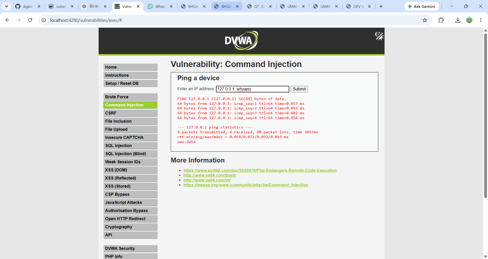
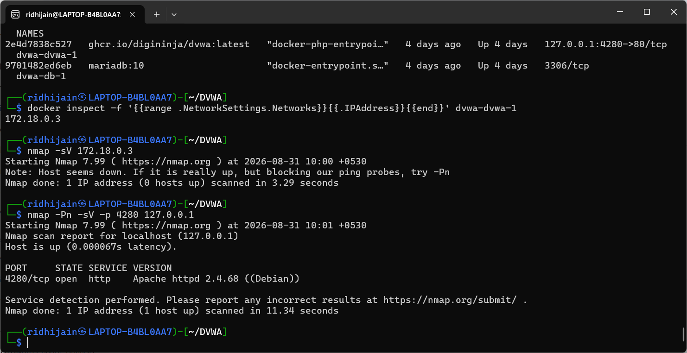
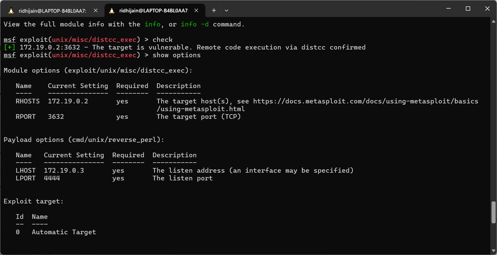
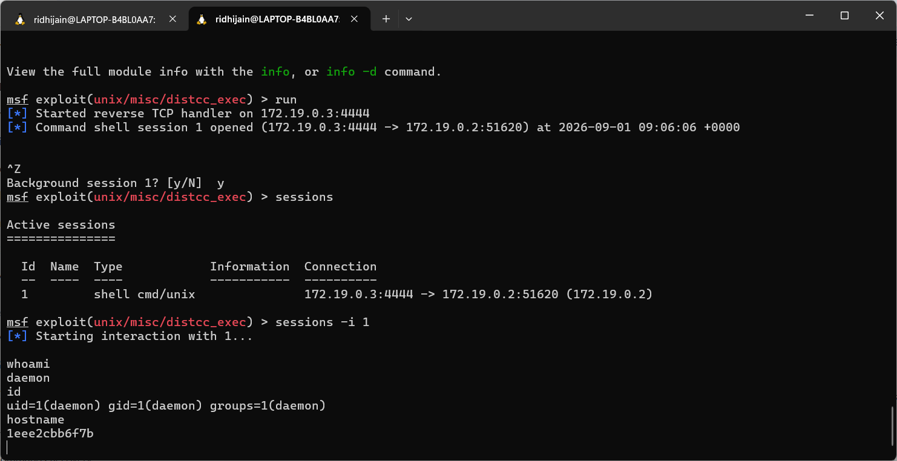

# DVWA Vulnerability Assessment and DistCC Remote Code Execution using Metasploit

## 📌 Project Overview

This project demonstrates hands-on cybersecurity testing in a controlled Docker-based laboratory environment.

The project is divided into two major parts:

1. **DVWA Vulnerability Assessment**
2. **DistCC Remote Code Execution using Metasploit**

The objective is to understand common web application vulnerabilities, perform security testing, identify vulnerable services, and demonstrate controlled remote command execution using the Metasploit Framework.

> ⚠️ **Disclaimer:** All testing in this project was performed in a controlled and isolated laboratory environment for educational purposes. No unauthorized systems were targeted.

---

## 🎯 Objectives

- Understand common web application vulnerabilities.
- Perform vulnerability assessment using DVWA.
- Practice security testing using Kali Linux.
- Perform network and service enumeration using Nmap.
- Understand vulnerable services in a controlled environment.
- Identify the vulnerable DistCC service.
- Use Metasploit Framework to validate the DistCC vulnerability.
- Demonstrate Remote Code Execution (RCE) in a controlled lab.
- Verify the obtained remote shell using basic Linux commands.

---

## 🛠️ Tools & Technologies

| Tool / Technology | Purpose |
|---|---|
| Kali Linux | Security testing environment |
| Docker | Isolated laboratory environment |
| DVWA | Vulnerable web application |
| Metasploitable2 | Intentionally vulnerable target |
| Metasploit Framework | Exploitation and vulnerability validation |
| Nmap | Network and service enumeration |
| Netcat | Network connectivity verification |
| Apache | Web server used by DVWA |
| DistCC | Vulnerable distributed compiler service |

---

## 🧪 Laboratory Environment

The project was performed using Docker containers connected through an isolated Docker network.

### Main Components

- **Attacker / Testing Machine:** Kali Linux
- **Web Application:** DVWA
- **Target Machine:** Metasploitable2
- **Exploitation Framework:** Metasploit Framework

### Network

The Metasploit and Metasploitable2 containers were connected through a custom Docker bridge network.

Example laboratory addresses:

```text
Metasploitable2 : 172.19.0.2
Metasploit      : 172.19.0.3
DistCC Port     : 3632
```

---

# 🔍 Part 1 — DVWA Vulnerability Assessment

DVWA (Damn Vulnerable Web Application) was used to practice different categories of web application vulnerabilities.

The following vulnerabilities were tested in the controlled environment:

- Command Injection
- File Inclusion
- SQL Injection
- Reflected XSS
- Stored XSS
- DOM XSS
- File Upload
- Weak Session IDs
- Open HTTP Redirect
- Cryptography Problems
- JavaScript Attacks
- CSP Bypass
- Blind SQL Injection
- Authorisation Bypass

---

## 🔹 Command Injection

Command Injection testing was performed through the DVWA Command Injection module.

A test input was used to demonstrate that operating-system commands could be executed through the vulnerable application.

Example:

```text
127.0.0.1; whoami
```

The response demonstrated command execution in the web-server context.

### Evidence



---

## 🔹 File Inclusion

The File Inclusion module was tested by accessing a local system file.

Example:

```text
/etc/passwd
```

The test demonstrated the impact of insecure file inclusion functionality in the vulnerable application.

---

## 🔹 SQL Injection

SQL Injection was demonstrated using a test input that altered the intended SQL query and returned multiple user records.

Example:

```text
1' OR '1'='1
```

The result demonstrated how improper input handling can allow an attacker to manipulate a database query.

---

## 🔹 Cross-Site Scripting (XSS)

Different categories of Cross-Site Scripting were tested:

- Reflected XSS
- Stored XSS
- DOM XSS

Browser-side execution was observed during testing.

The testing demonstrated how insufficient input validation and output encoding can allow malicious scripts to execute in a user's browser.

---

## 🔹 File Upload

The File Upload functionality was tested to understand insecure file upload behavior.

The test demonstrated the importance of validating uploaded files, file types, extensions, and server-side execution permissions.

---

## 🔹 Weak Session IDs

The Weak Session IDs module was tested by generating session identifiers and inspecting their values.

The test helped demonstrate the security risks associated with predictable session identifiers and weak session management.

---

## 🔹 Open HTTP Redirect

The Open HTTP Redirect functionality was tested by supplying an external destination.

The test demonstrated how improper URL validation can allow an application to redirect users to an attacker-controlled or untrusted destination.

---

## 🔹 Cryptography Problems

The Cryptography Problems module was tested using plaintext and encoded output.

The test helped demonstrate why weak or improperly implemented cryptographic mechanisms can expose sensitive information.

---

## 🔹 JavaScript Attacks

The JavaScript Attacks module was tested to understand client-side validation and JavaScript-based security weaknesses.

The source code and browser behavior were also inspected during testing.

---

## 🔹 CSP Bypass

The Content Security Policy (CSP) functionality was tested to understand how security policies can be bypassed when they are incorrectly configured.

Browser execution and network behavior were observed during the test.

---

## 🔹 Blind SQL Injection

The Blind SQL Injection module was tested using Boolean-based conditions.

Different responses were observed depending on whether the supplied condition was true or false.

This demonstrated how information can sometimes be inferred from application behavior even when database errors or query results are not directly displayed.

---

## 🔹 Authorisation Bypass

The Authorisation Bypass functionality was tested to understand whether restricted actions could be accessed without appropriate authorization.

The test demonstrated the importance of proper server-side authorization checks.

---

# 🌐 Part 2 — Network Enumeration

After the DVWA assessment, Docker containers and exposed services were examined.

Nmap was used for network and service enumeration.

Example:

```bash
nmap -sV 127.0.0.1
```

The exposed web service was identified and further testing was performed inside the controlled Docker environment.

### Evidence



---

# 💻 Part 3 — Metasploitable2 and DistCC

Metasploitable2 was deployed as an intentionally vulnerable target inside the isolated Docker laboratory.

The DistCC service was identified as running on TCP port:

```text
3632
```

Connectivity to the service was verified using Netcat.

Example:

```bash
nc -vz -w 3 172.19.0.2 3632
```

The port was confirmed to be open and reachable from the Metasploit environment.

---

# ⚡ Part 4 — Metasploit DistCC Vulnerability Testing

The Metasploit Framework was used to validate the vulnerable DistCC service.

The following Metasploit module was selected:

```text
exploit/unix/misc/distcc_exec
```

The target was configured with the laboratory network parameters.

### Configuration

```text
RHOSTS = 172.19.0.2
RPORT  = 3632
LHOST  = 172.19.0.3
LPORT  = 4444
```

The `check` command was used to determine whether the target was vulnerable.

The vulnerability check confirmed that the DistCC service was vulnerable to remote command execution.

### Evidence



---

# 🔐 Part 5 — Remote Code Execution

The project demonstrated **Remote Code Execution (RCE)** through the vulnerable DistCC service.

An initial reverse Bash payload was tested, but it failed because the target environment did not support the required `/dev/tcp` functionality.

A compatible Perl-based reverse payload was then selected:

```text
cmd/unix/reverse_perl
```

After configuring the payload and listener parameters correctly, a command shell was successfully established in the controlled laboratory environment.

---

# 🖥️ Part 6 — Successful Remote Shell

After obtaining the shell, basic Linux commands were executed to verify access to the target.

### `whoami`

```bash
whoami
```

Result:

```text
daemon
```

This confirmed the user context of the obtained shell.

### `id`

```bash
id
```

The command displayed the user ID, group ID, and group membership associated with the shell.

### `hostname`

```bash
hostname
```

The command displayed the hostname of the target system.

### Evidence



---

# 📊 Results and Observations

The project successfully demonstrated the following:

- Multiple vulnerabilities were identified and tested in DVWA.
- Network and service enumeration was performed using Nmap.
- Docker was used to create an isolated cybersecurity testing environment.
- The DistCC service running on TCP port 3632 was identified.
- Connectivity to the DistCC service was verified.
- Metasploit was used to validate the DistCC vulnerability.
- The initial reverse Bash payload failed because of target environment limitations.
- A compatible Perl-based payload was successfully used.
- Remote Code Execution was demonstrated in the controlled laboratory.
- A command shell was successfully obtained.
- Shell access was verified using `whoami`, `id`, and `hostname`.

---

# 🧠 Key Learning Outcomes

Through this project, I gained practical experience in:

- Web application vulnerability assessment.
- Network and service enumeration.
- Docker-based cybersecurity lab setup.
- Vulnerability identification and validation.
- Metasploit Framework usage.
- Exploit module selection.
- Payload selection and configuration.
- Troubleshooting failed payloads.
- Reverse shell concepts.
- Remote Code Execution concepts.
- Basic post-exploitation shell verification.
- Ethical and controlled security testing.

---

# ⚠️ Challenges Faced

Several challenges were encountered during the project:

### 1. DVWA Setup / CSRF Issue

During the initial DVWA setup, a CSRF-related error was encountered. The application environment and setup configuration were checked before continuing with the vulnerability testing.

### 2. Reverse Bash Payload Failure

The initial reverse Bash payload did not work because the target environment did not provide the required `/dev/tcp` functionality.

A different compatible payload was therefore selected.

### 3. Payload Compatibility

The `cmd/unix/reverse_perl` payload was selected because it was compatible with the target environment.

### 4. Docker Networking

The IP addresses of the Docker containers had to be identified and verified to ensure communication between the Metasploit environment and Metasploitable2.

### 5. Metasploit Session Handling

Understanding how to background and interact with Metasploit sessions was another practical challenge during the testing process.

These challenges helped improve troubleshooting and practical cybersecurity skills.

---

# 📁 Project Structure

```text
DVWA-Metasploit-Security-Project/
│
├── README.md
│
├── Project_Presentation/
│   └── Ridhi_Jain_DVWA_Metasploit_Project_Presentation.pptx
│
├── Screenshots/
│   ├── 01_DVWA_Command_Injection.png
│   ├── 02_Docker_Nmap_Enumeration.png
│   ├── 03_Metasploit_DistCC_Vulnerability_Check.png
│   └── 04_Metasploit_Successful_Remote_Shell.png
│
└── Project_Report/
    └── Ridhi_Jain_DVWA_Metasploit_Project_Report.pdf
```

---

# 📸 Project Evidence

The repository contains selected screenshots demonstrating the major stages of the project:

1. DVWA Command Injection testing
2. Docker and Nmap enumeration
3. Metasploit DistCC vulnerability validation
4. Successful Metasploit remote shell

Additional screenshots and detailed evidence are available in the project report and presentation.

---

# 📚 References

- Metasploit Framework Documentation
- DVWA (Damn Vulnerable Web Application)
- OWASP Web Security Resources
- Nmap Documentation
- NVD — CVE-2004-2687
- DistCC Security Information

---

# 👩‍💻 Author

**Ridhi Jain**

**Domain:** Cyber Security / Network Security

**Project Title:**  
**DVWA Vulnerability Assessment and DistCC Remote Code Execution using Metasploit**

---

# ⚖️ Ethical Use Disclaimer

This project was created strictly for educational and cybersecurity learning purposes.

All vulnerability testing and exploitation activities were performed against intentionally vulnerable applications and systems inside a controlled laboratory environment.

The techniques demonstrated in this repository should only be used on systems for which proper authorization has been obtained.

---

# ✅ Conclusion

This project provided practical experience in vulnerability assessment, web application security testing, network enumeration, Metasploit usage, exploit validation, payload selection, troubleshooting, and remote shell verification.

By combining DVWA, Docker, Metasploitable2, Kali Linux, Nmap, and Metasploit, the project demonstrated a complete cybersecurity testing workflow in a safe and controlled environment.

The project also highlighted the importance of proper security controls, secure configuration, input validation, authorization, session management, and responsible vulnerability testing.
